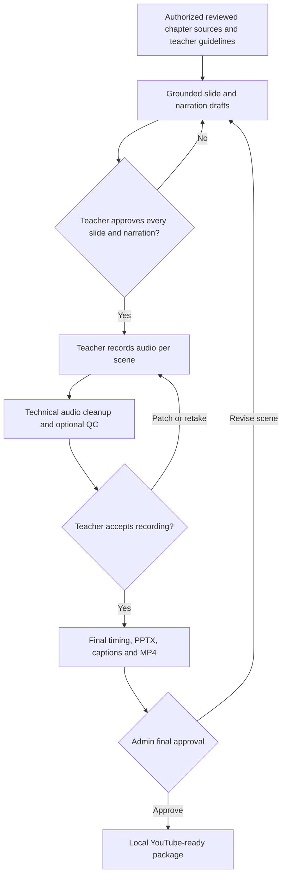

# Phase-1 Architecture

## Corrected production workflow

## Components

| Component | Phase-1 responsibility |
|---|---|
| Teacher portal | Lecture request, scene approval, scene recording, transcript review and corrections |
| Admin portal | Course/syllabus setup, quality review, render control and export approval |
| Application database | Users, courses, chapters, requests, versions, scenes, audio assets and approvals |
| Agent workspace | Shared tasks, decisions, handoffs and safe AI-development workflow |
| Custom MCP server | Controlled tools for project state first; lecture-domain tools are added incrementally |
| Slide engine | Scene JSON to editable PPTX and preview images |
| Audio engine | Format conversion, mild cleanup, Whisper transcript, QC flags and patch assembly |
| Render engine | Slide images, approved scene audio, captions and FFmpeg video composition |
| Distribution | Local output package and watched folders; no automatic publication without approval |

## T022 generation boundary

The current Django authentication adapter converts the signed-in teacher and T021 visibility rules
into an internal actor context. The generation domain consumes only that context, bounded guidelines
and immutable reviewed-page snapshots. Its replaceable provider returns structured text plus exact
source ranges; the domain validates those ranges before storing revisions or allowing approval.
See [SLIDE_GENERATION.md](SLIDE_GENERATION.md) for the model, APIs and future CRM/SSO and AI-provider
boundaries.

## Trust boundaries

1. Raw syllabus and teacher audio remain local.
2. AI-generated scripts and slides are drafts until teacher approval.
3. Transcript flags are suggestions until teacher approval.
4. Audio cuts cannot alter meaning without an approved correction record.
5. Final export requires admin approval.
6. External publication is a separate privileged operation.

## Shared-agent architecture

Claude Code and Codex do not rely on each other's chat history. They coordinate through:

- Git-tracked project instructions;
- `tasks/tasks.json` state and history;
- architecture decisions;
- status and handoff documents;
- the project MCP server;
- separate task ownership and later separate Git branches/worktrees.
